# doc-pipeline-java
This is a simple java application that is deployed onto AWS Elasticbeanstalk, using AWS Code pipeline.

### Team Members
* Devon 
* Matt
* Doug

[Deployed Site](http://deploymentappjava.us-east-2.elasticbeanstalk.com/)

### How to deploy using AWS Code Pipeline

#### Basic Setup:

  * Ensure your java application is running locally.
  * Within AWS Console, navigate to [code pipeline](https://us-east-2.console.aws.amazon.com/codesuite/codepipeline/start?region=us-east-2)
  * Create a new pipeline
    * 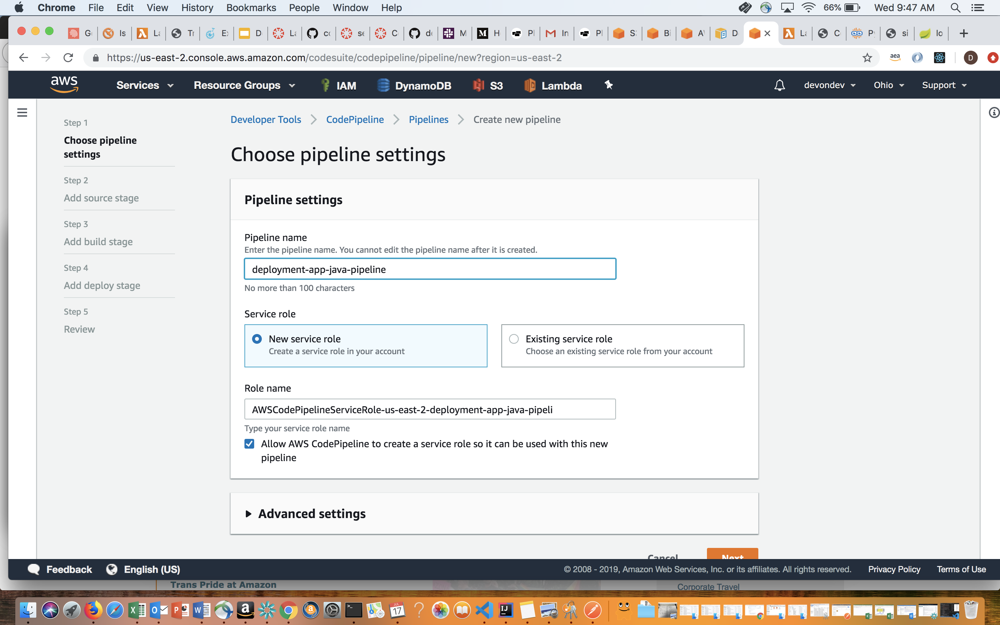
  * Configure pipeline with proper settings
    * 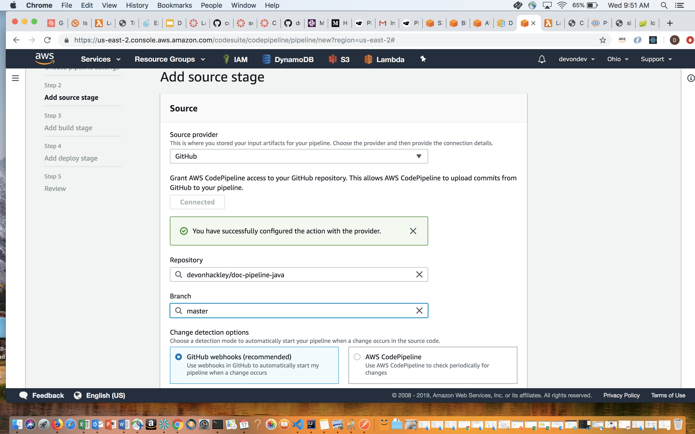
  * Configure deployment stage
    * 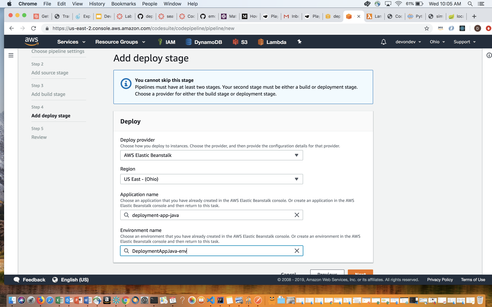
  *  Review configuration and submit
     * 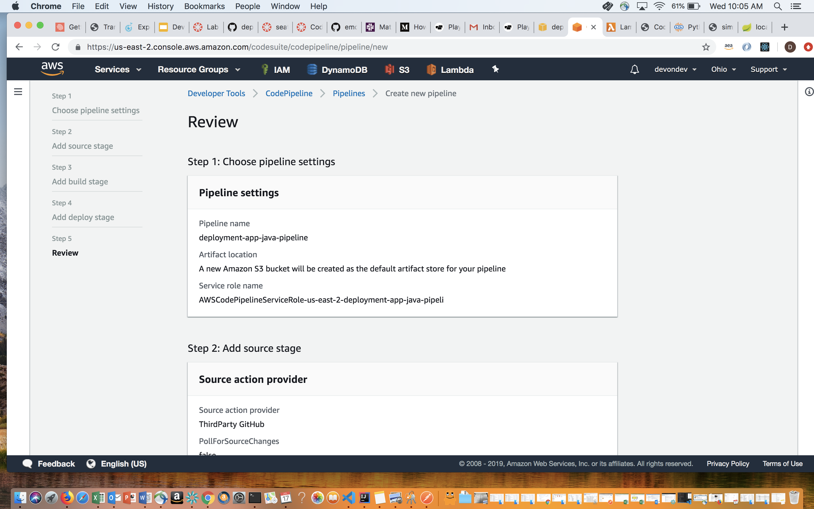  

#### Adding additional Stages:
  * Navigate to your pipeline
  * Click the edit button to bring up the edit stage view
     * 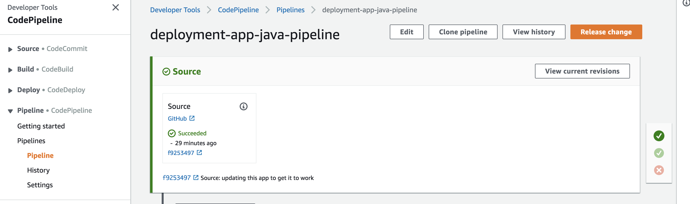 
  * Click the add Stage button and select a name for it
     * 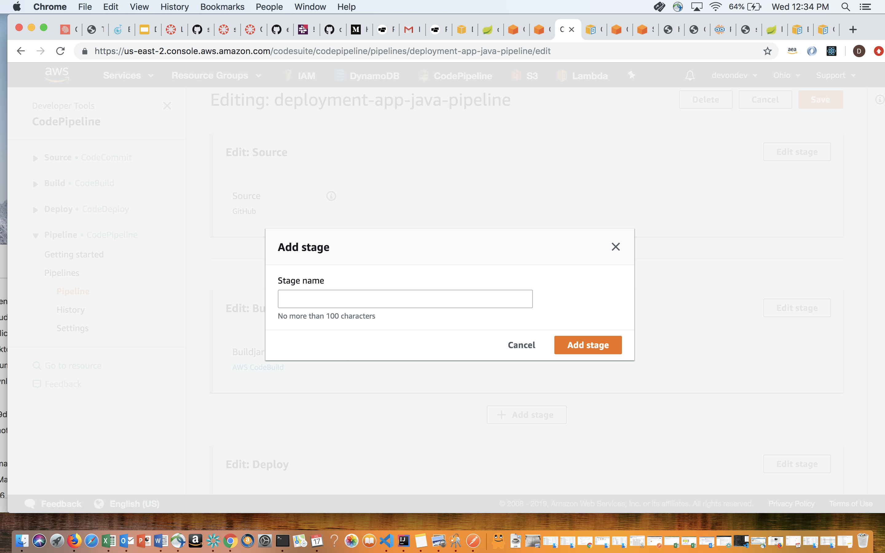
  * Click the add action group button within the new stage, and fill out form and choose AWS Codebuild as action provider
      * 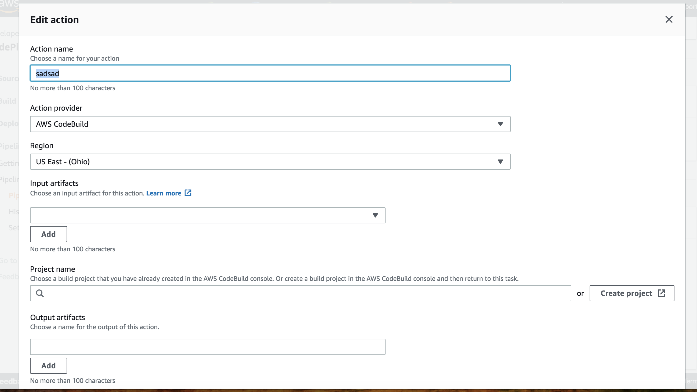 
  * In the project field choose Create Project
      * 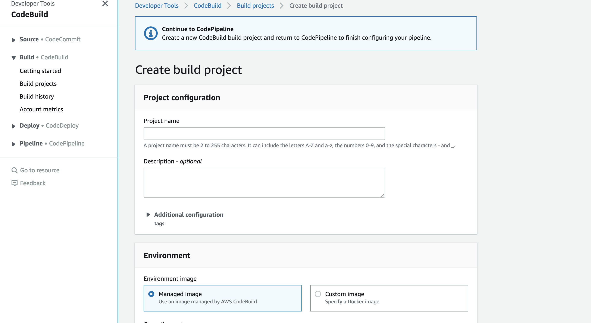 
  * Fill out the form, most can be left to the default. In the buildspec field, if your application needs to run any specific commands, this is where you'd add them
      * 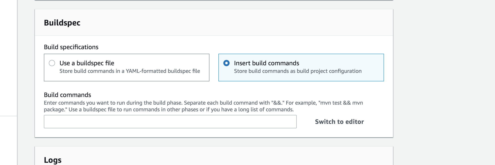  
      * Click continue to Code pipeline
      * 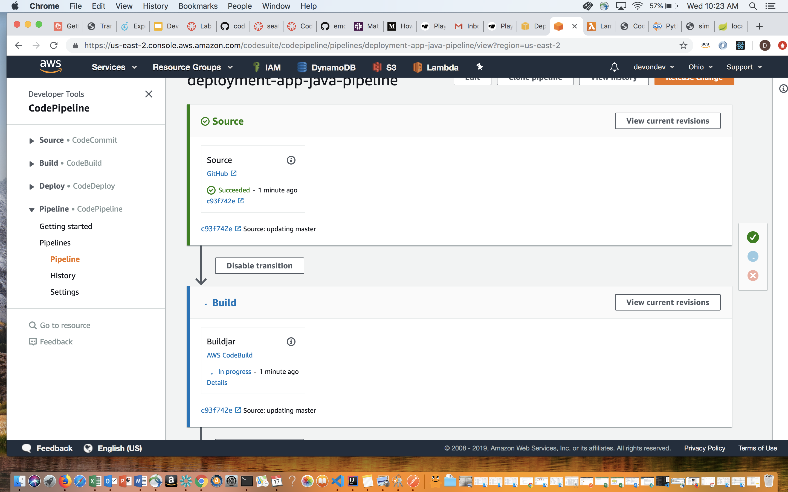
  *  Your pipeline should now be configured correctly 

  
  

#### Roadblocks
  * Transitioning artifacts thru the different stages
  * Not having a proper "Procfile" or "application.jar" file within the deployed stage
  * Codepipeline not being able to find the s3 bucket where the artifacts are
 
* 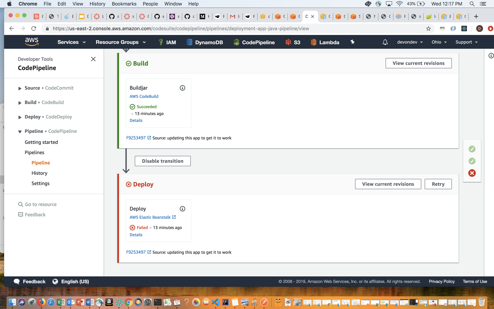
* 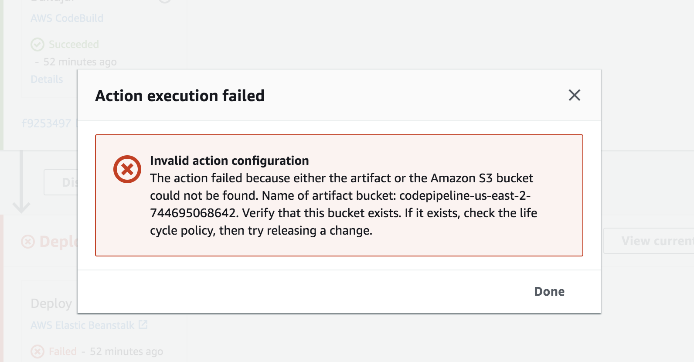  

